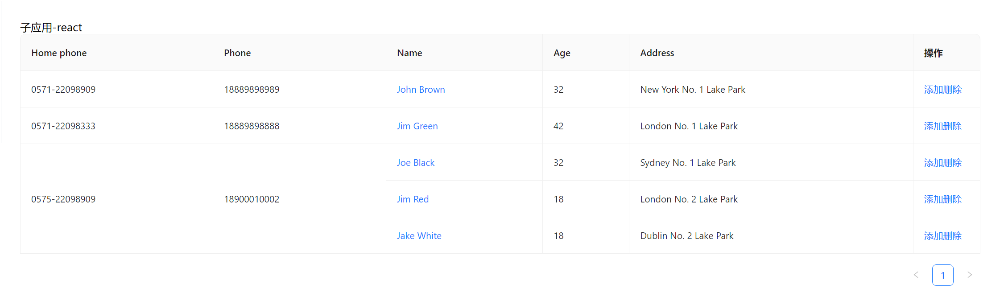

## 概述
一个基于monorepo框架的微前端系统，底层使用pnpm + wujie实现，用于收录前端应用实例。

## 启动
```bash
npm i pnpm -g
pnpm i
# 各应用会以.env文件中配置的端口名进行启动
# 在mac中该命令不可用，需分别启动主、子应用
pnpm -F * dev
```

## 应用
### react
#### react-01
列、行维度的合并，与动态删减


## 相关link
### 项目背景
https://www.yuque.com/chanwj/vlkwxk/qvpv3kqws5hno3qt?singleDoc#
### 项目更新目录
https://www.yuque.com/chanwj/ixiw69/erc4umk558evkpi7?singleDoc#